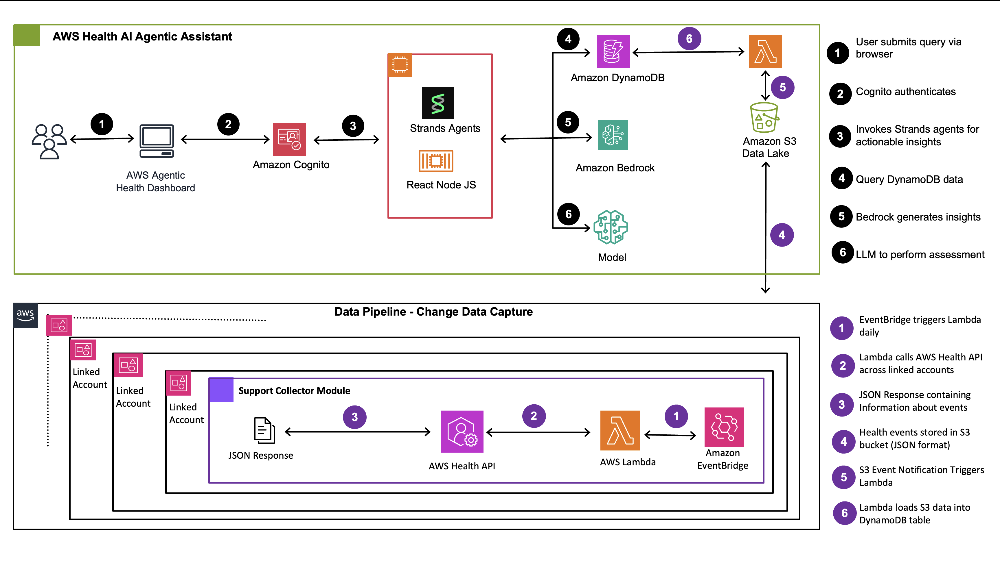

# CHAPLIN - AWS Health Event Analysis Tool

## Overview

### Problem Statement
Organizations struggle with reactive AWS health event management using static dashboards and manual processes. They often rely on AWS Support for health event interpretation and impact analysis, creating bottlenecks and delays in critical decision-making. A proactive, conversational AWS health analytics platform is needed to transform how organizations understand and respond to service changes, maintenance windows, and operational impacts through self-service capabilities.

### Chaplin Overview
Unlike traditional business intelligence dashboards with predefined schemas, Chaplin enables dynamic, on-demand report generation through natural language queries powered by agentic AI. Users can ask questions in plain english and receive contextualized insights instantly, eliminating the constraints of static dashboards. This enables customers to proactively take actions on their health events, reducing dependencies on AWS Support or TAMs for routine health event analysis and planning.

### Key Capabilities
- Converting natural language user queries to structured data queries with agentic insights
- Agents performing contextual impact analysis by combining customer metadata with unstructured health event descriptions
- Intelligent cost optimization using pattern-based classification, applying AI only for unstructured data for risk analysis to minimize processing costs
- Agents have the ability to understand customer context including customer metadata like environment (production, non-production), Business Units, Ownership etc.
- Built-in dashboards for common use cases that includes Migration Requirements, Security & Compliance, Maintenance & Updates, Cost Impact Events, Operational Notifications, and Configuration Alerts with critical events analysis and drill-down capabilities
- Multi-account data pipeline that collects health events across all customer accounts and centralizes data in S3 bucket, supporting flexible deployment models based on customer security posture (Option 1: Organizations APIs for centralized management, Option 2: Individual account deployments for customers with organizational restrictions)

## Architecture



### Technology Stack
- **AI Framework**: Strands Agents (an open-source framework developed by AWS) with Bedrock Claude Sonnet 4 (supports any LLM through Strands framework)
- **Backend**: Python 3.8+ with specialized agent architecture
- **Frontend**: React.js with real-time WebSocket streaming
- **Server**: Node.js/Express with WebSocket support
- **Database**: AWS DynamoDB (`chaplin-health-events` table)
- **Data Processing**: JSON-based event classification and analysis

### System Components

```
chaplin/
├── agents/                             # Specialized AI agents
│   ├── sql_query_agent.py              # Quantitative data analysis
│   ├── agentic_analysis_simple.py      # Real-time query interface
│   └── DBQueryBuilder.py               # DynamoDB query generation
├── health-dashboard/                   # React web interface
│   ├── server.js                       # Express.js API server
│   ├── client/src/App.js               # Main React application
│   └── package.json                    # Node.js dependencies
├── Core Analysis Scripts               # Event processing
│   ├── event_classifier.py             # Pattern-based categorization
│   ├── category_reports.py             # Report generation
│   └── insights_categorizer.py         # Alternative categorization
├── Data Management                     # Utilities
│   ├── dynamodb_reader.py              # DynamoDB access
│   └── process_csv.py                  # CSV processing
├── data_pipeline/                      # Multi-account data collection
│   ├── deploy_collector.sh             # Deployment script for Organizations
│   ├── deploy_stackset.py              # StackSet deployment automation
│   ├── member_account_resources.yaml   # CloudFormation template for member accounts
│   └── support-collector-lambda/       # Lambda functions for health event collection
│       ├── lambda_function.py          # Main Lambda handler
│       ├── health_client.py            # AWS Health API client
│       └── upload_health.py            # S3 upload handler
├── upload/                             # DynamoDB table setup and data upload scripts
├── test_agentic_analysis.py            # Agent testing script
├── chaplin-infrastructure.yaml         # CloudFormation infrastructure template
└── deploy_chaplin.sh                   # Deployment automation script
```

**Note**: The `output/` directory is created automatically at runtime for caching reports and analysis results.

## Prerequisites

### AWS Requirements
- **AWS Account** with appropriate permissions
- **AWS CLI** configured with credentials
- **Amazon Bedrock**: Access to Claude Sonnet 4 in `us-east-1`
- **S3 Bucket**: An S3 bucket for health event data storage
  - If you've already deployed the data pipeline, use the same bucket
  - If not, create a new bucket - the data pipeline will use this bucket later

### System Requirements
- **Python**: 3.8 or higher
- **Node.js**: 16.x or higher
- **npm**: 8.x or higher
- **Operating System**: macOS, Linux, or Windows with WSL

**Note**: The deployment script automatically creates DynamoDB table and Cognito User Pool.

## Installation

### Deployment Steps

One script deploys Chaplin. The script handles database setup, dependency installation, and configuration.

**Run the deployment script:**
```bash
# Clone the repository
git clone https://github.com/aws-samples/sample-aws-health-agentic-assistant.git
cd sample-aws-health-agentic-assistant

# Run deployment
chmod +x deploy_chaplin.sh
./deploy_chaplin.sh
```

**The script will:**
1. Prompt for AWS Region (default: us-east-1)
2. Prompt for S3 bucket name (must already exist for health event data)
3. Deploy Cognito User Pool, DynamoDB Table, and S3-to-DynamoDB Lambda via CloudFormation
4. Configure S3 event notification to trigger Lambda on new health events
5. Install all dependencies and build the React application
6. Create the required output directory
7. Start the application automatically

**To create a user:**
```bash
aws cognito-idp admin-create-user --user-pool-id <USER_POOL_ID> --username admin@example.com --message-action SUPPRESS --region us-east-1 && aws cognito-idp admin-set-user-password --user-pool-id <USER_POOL_ID> --username <user name> --password  <password>  --region us-east-1
```
(The script will display the exact command with your User Pool ID)

Alternatively, you can create users via the [Cognito console](https://docs.aws.amazon.com/cognito/latest/developerguide/how-to-create-user-accounts.html).

After creating a Cognito user, access the web dashboard at http://localhost:3001

### Data Pipeline Setup

Chaplin requires AWS Health Events data. You can deploy Chaplin before or after setting up the data pipeline:

**Scenario 1: Data pipeline already deployed**
- Use the existing S3 bucket when running `./deploy_chaplin.sh`

**Scenario 2: Data pipeline not yet deployed**
- Create an S3 bucket
- Run `./deploy_chaplin.sh` and provide the bucket name
- Later, deploy the data pipeline using the same bucket (see [data_pipeline/README.md](data_pipeline/README.md))

**Data Pipeline Deployment Options**:
- **Option 1: AWS Organizations** - Bulk deployment across multiple accounts (recommended)
- **Option 2: Individual Accounts** - Manual deployment to specific accounts

See **[data_pipeline/README.md](data_pipeline/README.md)** for detailed deployment instructions.

## Usage

The deployment script automatically starts the application. After creating a Cognito user (see the command output from deployment), navigate to http://localhost:3001

### Web Interface Features
- **Authentication**: AWS Cognito-based user authentication
- **Event Categories**: Browse by AWS event categories
- **Event Types**: Filter by business impact types
- **Critical Events**: View upcoming critical events (30-day, 60-day, past due)
- **Agentic Diagnostics**: Real-time AI-powered analysis
- **Export Functionality**: Download data as CSV/Excel


## Production Deployment

This guide covers local development deployment. For production environments:

### Agent Deployment Options

Deploy Strands agents using various AWS services:

- **[Bedrock AgentCore](https://strandsagents.com/latest/documentation/docs/user-guide/deploy/operating-agents-in-production/)** - Serverless runtime purpose-built for deploying and scaling AI agents
- **[AWS Lambda](https://strandsagents.com/latest/documentation/docs/user-guide/deploy/operating-agents-in-production/)** - Serverless option for short-lived agent interactions and batch processing
- **[AWS Fargate](https://strandsagents.com/latest/documentation/docs/user-guide/deploy/operating-agents-in-production/)** - Containerized deployment with streaming support for real-time responses
- **[Amazon EKS](https://strandsagents.com/latest/documentation/docs/user-guide/deploy/operating-agents-in-production/)** - Kubernetes-based deployment for high concurrency
- **[Amazon EC2](https://strandsagents.com/latest/documentation/docs/user-guide/deploy/operating-agents-in-production/)** - Maximum control for high-volume applications

See [Strands Deployment Patterns](https://strandsagents.com/latest/documentation/docs/user-guide/deploy/operating-agents-in-production/) for detailed guides.

### Web Application Deployment

You may consider one of the following options to deploy the Node.js/React application:

- **[AWS Fargate](https://docs.aws.amazon.com/AmazonECS/latest/developerguide/AWS_Fargate.html)** - Recommended for containerized deployment with auto-scaling and load balancing
- **[Amazon EC2](https://docs.aws.amazon.com/codedeploy/latest/userguide/tutorials-github.html)** - For full control over the runtime environment
- **[AWS Elastic Beanstalk](https://docs.aws.amazon.com/elasticbeanstalk/latest/dg/create_deploy_nodejs.html)** - Simplified deployment with automatic capacity provisioning

Consider using Amazon CloudFront for CDN and AWS Application Load Balancer for high availability.
