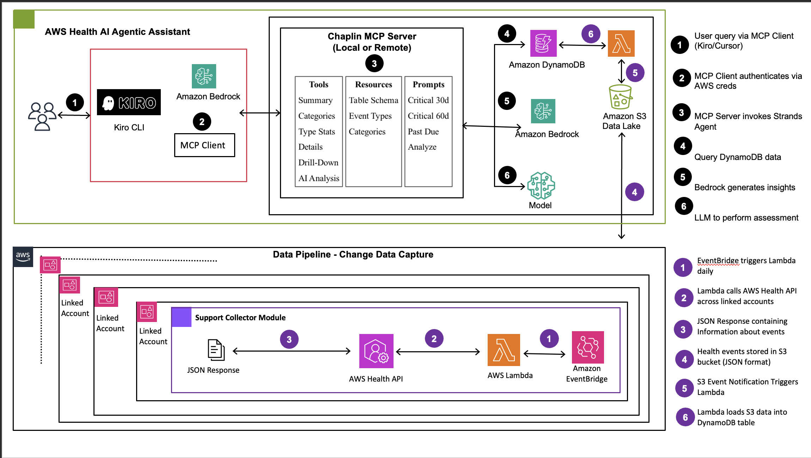

# CHAPLIN - AWS Health Event Analysis Tool

## Overview

### Problem Statement
Organizations struggle with reactive AWS health event management using static dashboards and manual processes. They often rely on AWS Support for health event interpretation and impact analysis, creating bottlenecks and delays in critical decision-making. A proactive, conversational AWS health analytics platform is needed to transform how organizations understand and respond to service changes, maintenance windows, and operational impacts through self-service capabilities.

### Chaplin Overview
Unlike traditional business intelligence dashboards with predefined schemas, Chaplin enables dynamic, on-demand report generation through natural language queries powered by agentic AI. Users can ask questions in plain english and receive contextualized insights instantly, eliminating the constraints of static dashboards. This enables customers to proactively take actions on their health events, reducing dependencies on AWS Support or TAMs for routine health event analysis and planning.

### Key Capabilities
- Converting natural language user queries to structured data queries with agentic insights
- Agents performing contextual impact analysis by combining customer metadata with unstructured health event descriptions
- Intelligent cost optimization using pattern-based classification, applying AI only for unstructured data for risk analysis to minimize processing costs
- Agents have the ability to understand customer context including customer metadata like environment (production, non-production), Business Units, Ownership etc.
- Built-in dashboards for common use cases that includes Migration Requirements, Security & Compliance, Maintenance & Updates, Cost Impact Events, Operational Notifications, and Configuration Alerts with critical events analysis and drill-down capabilities
- Multi-account data pipeline that collects health events across all customer accounts and centralizes data in S3 bucket, supporting flexible deployment models based on customer security posture (Option 1: Organizations APIs for centralized management, Option 2: Individual account deployments for customers with organizational restrictions)

## Architecture

Chaplin uses a two-part architecture: a data pipeline that collects AWS Health Events across linked accounts into DynamoDB via S3, and an MCP server that exposes this data to AI agents. The MCP server provides both instant DynamoDB lookups for structured queries and Strands Agent + Bedrock Claude analysis for natural language insights.



## Prerequisites

### AWS Requirements
- **AWS Account** with appropriate permissions
- **AWS CLI** configured with credentials
- **Amazon Bedrock**: Access to a foundation model in `us-east-1`. Default: Anthropic Claude Sonnet 4.5 (`us.anthropic.claude-sonnet-4-5-20250929-v1:0`). Configurable - Strands Agents supports any Bedrock model or external providers like Ollama.
- **S3 Bucket**: An S3 bucket for health event data storage
  - If you've already deployed the data pipeline, use the same bucket
  - If not, create a new bucket - the data pipeline will use this bucket later

### System Requirements
- **Python**: 3.10 or higher
- **Operating System**: macOS, Linux, or Windows with WSL

## Data Pipeline Setup

Chaplin requires AWS Health Events data. You can deploy Chaplin before or after setting up the data pipeline:

**Scenario 1: Data pipeline already deployed**
- Use the existing S3 bucket when deploying Chaplin

**Scenario 2: Data pipeline not yet deployed**
- Create an S3 bucket
- Deploy Chaplin and provide the bucket name
- Later, deploy the data pipeline using the same bucket (see [data_pipeline/README.md](data_pipeline/README.md))

**Data Pipeline Deployment Options**:
- **Option 1: AWS Organizations** - Bulk deployment across multiple accounts (recommended)
- **Option 2: Individual Accounts** - Manual deployment to specific accounts

See **[data_pipeline/README.md](data_pipeline/README.md)** for detailed deployment instructions.

## MCP Deployment

Chaplin has two deployment layers:

1. **Infrastructure** - Backend resources that store and process health events:
   - DynamoDB table (`chaplin-health-events` - stores all health event data)
   - S3-to-DynamoDB Lambda (automatically ingests new health events from S3 into DynamoDB)
   - S3 event notification (triggers the Lambda when new `.json` files land in your S3 bucket)

2. **MCP Server** - Exposes the health event data to AI agents via the MCP protocol. This is what Kiro/Cursor/VS Code/Claude Code connects to.

### MCP Installation Options

#### Option A: Local Install (via uv)

Runs the MCP server locally on your machine, connecting directly to DynamoDB and Bedrock using your AWS credentials.

> **1) Full deployment** (infrastructure + MCP) - recommended for first time:

Deploy infrastructure first, then add the MCP server to your AI assistant using the buttons/commands in step 2.

```bash
chmod +x install-infra.sh
./install-infra.sh
```

> **2) MCP only** - if infrastructure is already deployed:

** Kiro CLI:**
```bash
kiro-cli mcp add --force --name chaplin-health --command uvx --args "chaplin-health-mcp@latest" --env AWS_PROFILE=default --env AWS_REGION=us-east-1
```

| Kiro IDE | Cursor | VS Code |
|:--------:|:------:|:-------:|
| [](https://kiro.dev/launch/mcp/add?name=chaplin-health&config=%7B%22command%22%3A%22uvx%22%2C%22args%22%3A%5B%22chaplin-health-mcp%40latest%22%5D%2C%22env%22%3A%7B%22AWS_PROFILE%22%3A%22default%22%2C%22AWS_REGION%22%3A%22us-east-1%22%7D%7D) | [](https://cursor.com/en/install-mcp?name=chaplin-health&config=eyJjb21tYW5kIjoidXZ4IiwiYXJncyI6WyJjaGFwbGluLWhlYWx0aC1tY3BAbGF0ZXN0Il0sImVudiI6eyJBV1NfUFJPRklMRSI6ImRlZmF1bHQiLCJBV1NfUkVHSU9OIjoidXMtZWFzdC0xIn19) | [](https://insiders.vscode.dev/redirect/mcp/install?name=chaplin-health&config=%7B%22command%22%3A%22uvx%22%2C%22args%22%3A%5B%22chaplin-health-mcp%40latest%22%5D%2C%22env%22%3A%7B%22AWS_PROFILE%22%3A%22default%22%2C%22AWS_REGION%22%3A%22us-east-1%22%7D%7D) |

** Claude Code:**
```bash
claude mcp add chaplin-health -- uvx chaplin-health-mcp@latest
```

Or configure manually in your MCP client (e.g., `~/.kiro/settings/mcp.json`):

```json
{
  "mcpServers": {
    "chaplin-health": {
      "command": "uvx",
      "args": ["chaplin-health-mcp@latest"],
      "env": {
        "AWS_PROFILE": "default",
        "AWS_REGION": "us-east-1"
      }
    }
  }
}
```

> **Requirements**: Python 3.10+, [uv](https://docs.astral.sh/uv/getting-started/installation/), AWS credentials configured.

#### Option B: Remote Deploy (via Lambda)

Deploys the MCP server as a Lambda function in your AWS account. Team members connect via [mcp-proxy-for-aws](https://pypi.org/project/mcp-proxy-for-aws/) - no local Python or uv needed.

> **1) Full deployment** (infrastructure + MCP) - recommended for first time:

```bash
chmod +x deploy_chaplin.sh install-infra.sh mcp/install-mcp.sh
./deploy_chaplin.sh
```

The script automatically configures Kiro CLI (`~/.kiro/settings/mcp.json`) with the deployed endpoint. For other AI assistants (Kiro IDE, Cursor, VS Code, Claude Code), use the Function URL from the deployment output with the manual config shown below.

> **2) MCP only** - if infrastructure is already deployed:

```bash
cd mcp/
chmod +x install-mcp.sh
./install-mcp.sh
```

The script will:
1. Prompt for AWS Region (default: us-east-1)
2. Build and upload the Lambda deployment package to S3
3. Deploy a CloudFormation stack with Lambda (Graviton/ARM64) and Function URL
4. Auto-configure Kiro CLI (`~/.kiro/settings/mcp.json`) with the deployed endpoint

For other AI assistants, use the Function URL from the deployment output:

```json
{
  "mcpServers": {
    "chaplin-health": {
      "command": "uvx",
      "args": [
        "mcp-proxy-for-aws@latest",
        "<FUNCTION_URL>mcp",
        "--service", "lambda",
        "--profile", "default",
        "--region", "us-east-1"
      ]
    }
  }
}
```

> **Note**: Requires `uv` installed ([install guide](https://docs.astral.sh/uv/getting-started/installation/)). Replace `<FUNCTION_URL>` with the Lambda Function URL from the deployment output.

> **Authentication**: [mcp-proxy-for-aws](https://pypi.org/project/mcp-proxy-for-aws/) runs locally as a client-side bridge that signs requests with AWS SigV4 using your local AWS credentials (`~/.aws/credentials`). The Lambda Function URL uses IAM auth - no separate OAuth or API keys needed.

**Cleanup:**
```bash
aws cloudformation delete-stack --stack-name chaplin-health-mcp --region us-east-1
```

### Verify It Works

After deployment, restart your MCP-compatible assistant and try:

```
Show me upcoming critical events in the next 30 days
```

The assistant will call the `get_critical_events_30d` tool via the MCP server, which uses the Strands Agent + Bedrock to analyze your health events and return a prioritized summary.

## MCP Server Details

**Important Note**: AI analysis agent tools invoke Amazon Bedrock and may take 30-60 seconds. Summary and detail agent tools query DynamoDB directly and return instantly.

### Features

#### Health Event Intelligence
- **Event category breakdown**: Issue, Account Notification, Scheduled Change, Investigation - with event and service counts
- **Event type classification**: Configuration Alerts, Cost Impact Events, Maintenance Updates, Migration Requirements, Operational Notifications, Security Compliance
- **Critical event tracking**: Upcoming events in 30-day and 30-60 day windows, plus past due events (120 days)
- **Drill-down details**: Filter events by service, category, status, region, account, event type, or ARN

#### AI-Powered Analysis
- **Natural language queries**: Ask questions about your health events in plain English
- **Agentic diagnostics**: Strands Agent + Bedrock Claude pipeline for contextual impact analysis
- **Proactive insights**: Identify risks, recommend actions, and surface critical patterns across accounts

### Example Prompts

```
# Event Categories (instant)
Show me all Issue events - service issues and outages
Show me Account Notification events - account-specific notifications
What are the Scheduled Change events - planned maintenance and changes?
Are there any Investigation events?

# Event Types (instant)
Show me Configuration Alerts - configuration issues, expiring resources
What are the Cost Impact Events - billing changes, capacity reservations?
Show me Maintenance Updates - scheduled maintenance, automatic updates
What Migration Requirements are there - platform migrations, version upgrades, instance retirements?
Show me Operational Notifications - service issues, operational alerts
Are there any Security Compliance events - security patches, vulnerability notifications?

# Drill-Down (instant)
Show me open LAMBDA scheduled change events
Drill down into S3 events in us-east-1
What are the upcoming DOCDB events?

# AI Agent Analysis
Show me the event categories breakdown
What are the event type stats?
What Bedrock models are going end of life?
Give me open Lambda events and highlight critical ones
Can you check upcoming events for RDS?
Which accounts have the most open health events?
Give me a plan to remediate the Lambda critical event
```

### Tools

#### Overview & Summary

Quick counts and breakdowns across all health events. These agent tools query DynamoDB directly and return instantly.

| Tool | Description |
|------|-------------|
| `get_health_summary` | High-level counts by service, status, category, region |
| `get_critical_events_count` | Count of critical events in the next 30 days |
| `get_event_categories` | Event Categories - Issue, Account Notification, Scheduled Change, Investigation |
| `get_event_type_stats` | Event Types - Configuration Alerts, Cost Impact, Maintenance, Migration, Operational, Security |

#### Detail Views

Drill into specific categories, event types, or filtered event lists. These agent tools return summarized event records directly from DynamoDB.

| Tool | Description |
|------|-------------|
| `get_event_category_details(category_id)` | Events for a specific category (e.g. `issue`, `accountNotification`) |
| `get_event_type_details(event_type_id)` | Events for a specific type (e.g. `migration-requirements`, `security-compliance`) |
| `get_drill_down_details(...)` | Filter events by service, category, status, region, account, event_type, arn |
| `get_cached_prompts` | Previously used prompts with usage counts |

#### AI Agent Analysis

Natural language analysis powered by Strands Agent and Bedrock Claude. These tools interpret your query, fetch relevant data from DynamoDB, and generate contextual insights.

| Tool | Description |
|------|-------------|
| `analyze_health_events(prompt)` | Free-form natural language analysis |
| `get_critical_events_30d` | Upcoming critical events in next 30 days |
| `get_critical_events_60d` | Upcoming critical events in 30-60 day window |
| `get_past_due_events` | Past due events (120 days) still open/upcoming |

### AWS Authentication

The MCP server requires specific AWS permissions and configuration:

#### Required Permissions

Your AWS IAM role or user must have the following permissions:

- `dynamodb:Scan`, `dynamodb:Query`, `dynamodb:DescribeTable` on `chaplin-health-events` table
- `bedrock:InvokeModel` for Anthropic Claude Sonnet 4.5 in `us-east-1` (required for AI analysis tools only)

#### Configuration

The server uses two key environment variables:

- **`AWS_PROFILE`**: Specifies the AWS profile to use from your AWS configuration file. If not provided, it defaults to the "default" profile.
- **`AWS_REGION`**: Determines the AWS region for DynamoDB and Bedrock API calls. Defaults to `us-east-1`.

```json
"env": {
  "AWS_PROFILE": "default",
  "AWS_REGION": "us-east-1"
}
```

## Web Dashboard (Optional)

Chaplin also includes an optional React-based web dashboard for visual browsing and analysis. See **[README_WEB.md](README_WEB.md)** for web interface setup and deployment instructions.


