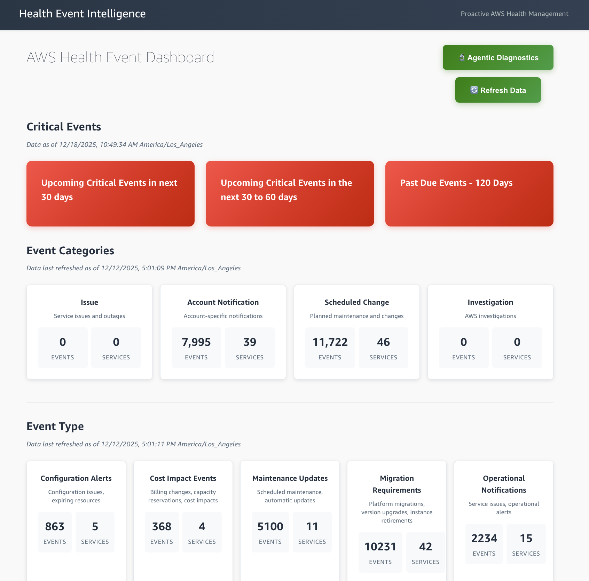
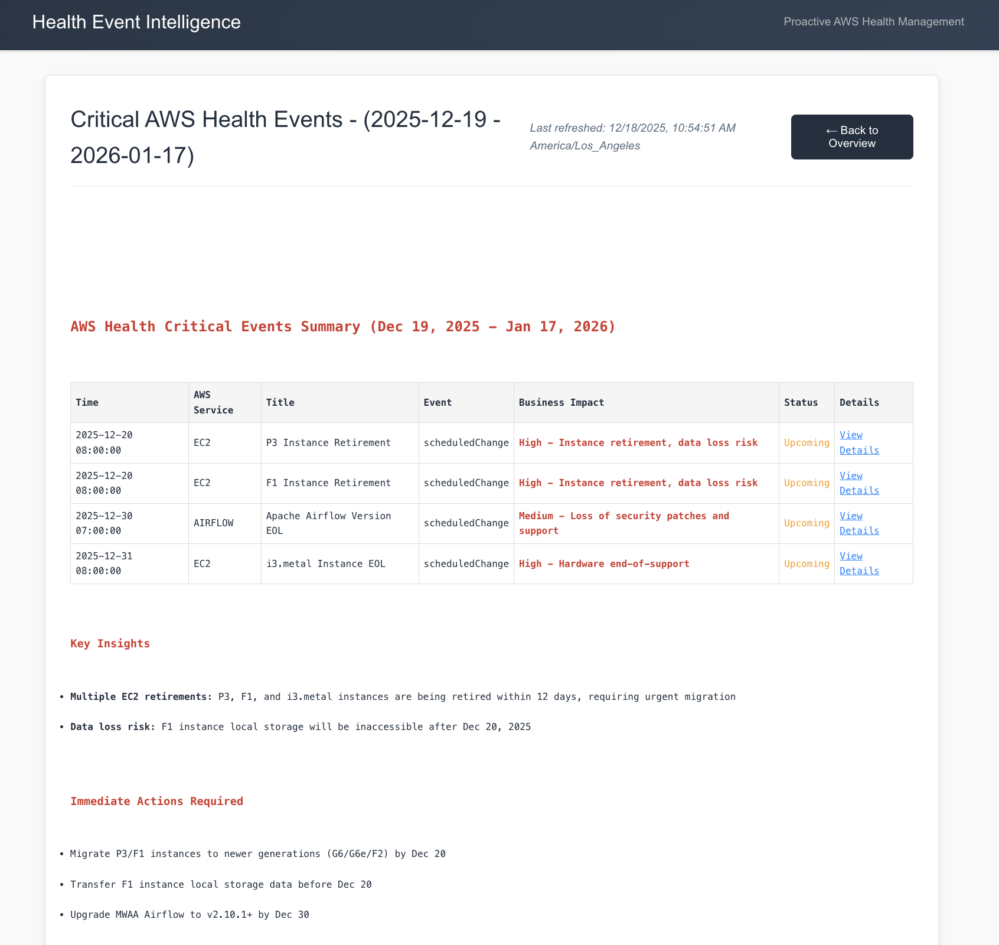
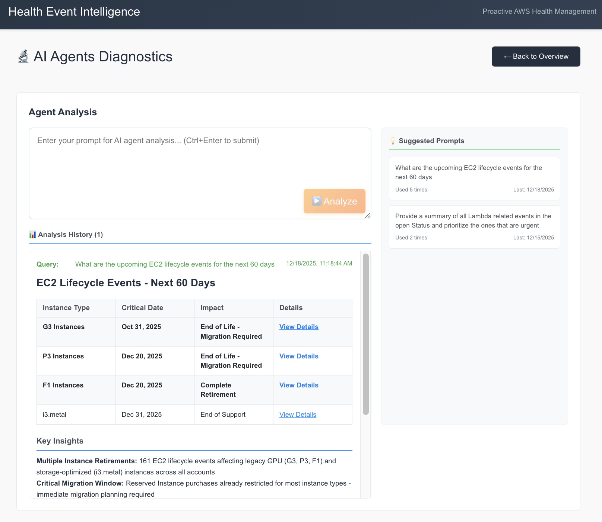
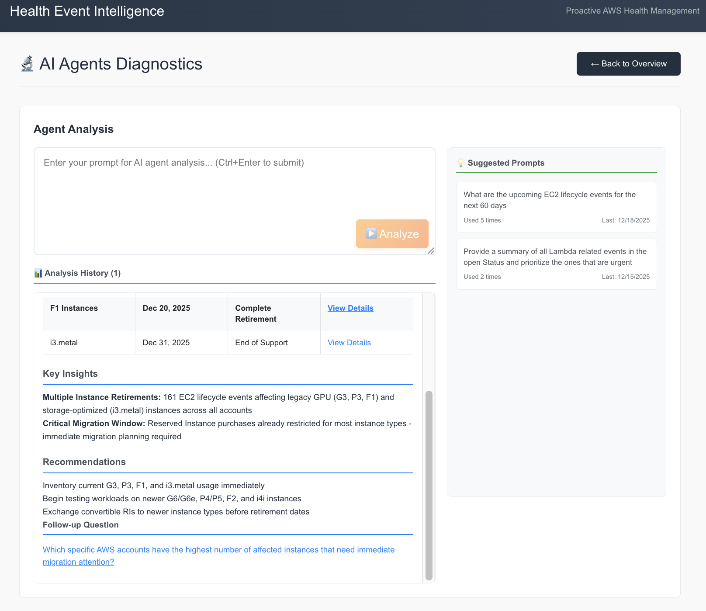
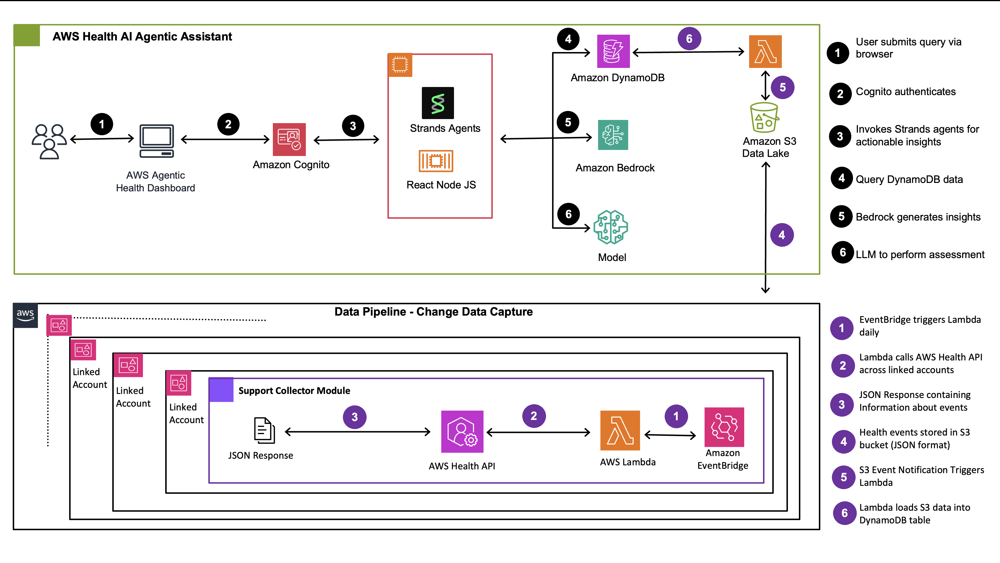

# CHAPLIN - Web Dashboard

Optional web interface for Chaplin — a React-based dashboard for browsing and analyzing AWS Health Events visually.

> **Note**: The web dashboard is optional. Chaplin's core capabilities are available via the [MCP server](mcp/README.md) and CLI without a browser. See the [main README](README.md) for the agentic AI approach.

## Sample Screenshots






## Architecture



### Technology Stack
- **AI Framework**: Strands Agents (an open-source framework developed by AWS) with Bedrock Claude Sonnet 4 (supports any LLM through Strands framework)
- **Backend**: Python 3.8+ with specialized agent architecture
- **Frontend**: React.js with real-time WebSocket streaming
- **Server**: Node.js/Express with WebSocket support
- **Database**: AWS DynamoDB (`chaplin-health-events` table)
- **Data Processing**: JSON-based event classification and analysis

### System Components

```
chaplin/
├── agents/                             # Specialized AI agents
│   ├── sql_query_agent.py              # Quantitative data analysis
│   ├── agentic_analysis_simple.py      # Real-time query interface
│   └── DBQueryBuilder.py               # DynamoDB query generation
├── health-dashboard/                   # React web interface
│   ├── server.js                       # Express.js API server
│   ├── client/src/App.js               # Main React application
│   └── package.json                    # Node.js dependencies
├── Core Analysis Scripts               # Event processing
│   ├── event_classifier.py             # Pattern-based categorization
│   ├── category_reports.py             # Report generation
│   └── insights_categorizer.py         # Alternative categorization
├── Data Management                     # Utilities
│   ├── dynamodb_reader.py              # DynamoDB access
│   └── process_csv.py                  # CSV processing
├── data_pipeline/                      # Multi-account data collection
│   ├── deploy_collector.sh             # Deployment script for Organizations
│   ├── deploy_stackset.py              # StackSet deployment automation
│   ├── member_account_resources.yaml   # CloudFormation template for member accounts
│   └── support-collector-lambda/       # Lambda functions for health event collection
│       ├── lambda_function.py          # Main Lambda handler
│       ├── health_client.py            # AWS Health API client
│       └── upload_health.py            # S3 upload handler
├── upload/                             # DynamoDB table setup and data upload scripts
├── test_agentic_analysis.py            # Agent testing script
├── chaplin-infrastructure.yaml         # CloudFormation infrastructure template
├── chaplin-ec2-infrastructure.yaml     # CloudFormation EC2 deployment template
├── deploy_chaplin_web.sh                   # Local deployment automation script
└── deploy_chaplin_ec2.sh               # EC2 deployment automation script
```

**Note**: The `output/` directory is created automatically at runtime for caching reports and analysis results.

## Prerequisites

### AWS Requirements
- **AWS Account** with appropriate permissions
- **AWS CLI** configured with credentials
- **Amazon Bedrock**: Access to Claude Sonnet 4 in `us-east-1`
- **S3 Bucket**: An S3 bucket for health event data storage

### System Requirements
- **Python**: 3.8 or higher
- **Node.js**: 16.x or higher
- **npm**: 8.x or higher
- **Operating System**: macOS, Linux, or Windows with WSL

**Note**: The deployment script automatically creates DynamoDB table and Cognito User Pool.

## Installation

### Local Deployment

One script deploys Chaplin locally. The script handles database setup, dependency installation, and configuration.

**Run the deployment script:**
```bash
# Clone the repository
git clone https://github.com/aws-samples/sample-aws-health-agentic-assistant.git
cd sample-aws-health-agentic-assistant

# Run deployment
chmod +x deploy_chaplin_web.sh
./deploy_chaplin_web.sh
```

**The script will:**
1. Prompt for AWS Region (default: us-east-1)
2. Prompt for S3 bucket name (must already exist for health event data)
3. Prompt for Cognito user email
4. Ask whether to restrict signups to that email domain (default: yes)
5. Deploy Cognito User Pool, DynamoDB Table, and S3-to-DynamoDB Lambda via CloudFormation
6. Configure S3 event notification to trigger Lambda on new health events
7. Create a Cognito user with the provided email
8. Install all dependencies and build the React application
9. Create the required output directory
10. Start the application automatically

After deployment, access the web dashboard at http://localhost:3001 and login with the email and temporary password shown in the deployment output. You will be forced to change the password on first login.

**Note**: The script runs the server in the foreground. To run it in the background, press `Ctrl+C` to stop, then use one of:
```bash
# Option 1: Using nohup
cd health-dashboard && nohup npm start > chaplin.log 2>&1 &

# Option 2: Using pm2 (recommended for persistent background process)
npm install -g pm2
cd health-dashboard && pm2 start npm --name chaplin -- start
```

### EC2 Deployment

A single script deploys Chaplin to an EC2 instance with secure network configuration. All AWS resources are managed via CloudFormation for easy cleanup.

**Run the EC2 deployment script:**
```bash
chmod +x deploy_chaplin_ec2.sh
./deploy_chaplin_ec2.sh
```

**The script will prompt for:**
1. AWS Region (default: us-east-1)
2. S3 bucket name (must already exist)
3. Cognito user email
4. Whether to restrict signups to that email domain (default: yes)

**Note**: The EC2 instance type defaults to `t3.medium`. To change it, edit the `INSTANCE_TYPE` variable at the top of `deploy_chaplin_ec2.sh`.

**What it creates (two CloudFormation stacks):**

| Stack | Resources |
|-------|-----------|
| `chaplin-ec2-<region>` | EC2 instance, Security Group, IAM Role/Instance Profile, EC2 Instance Connect Endpoint |
| `chaplin-infrastructure-stack` | Cognito User Pool, DynamoDB Table, S3-to-DynamoDB Lambda |

**Security features:**
- Port 3001 is restricted to the deployer's public IP only (no public internet access)
- No SSH port exposed — access is via [EC2 Instance Connect Endpoint](https://docs.aws.amazon.com/AWSEC2/latest/UserGuide/connect-using-eice.html) (private connectivity)
- Cognito authentication on the application layer
- IAM instance profile with least-privilege permissions

**Granting access to additional users:**

By default, only the IP of the machine running the deploy script can access port 3001. To allow other users, add their IPs to the Security Group:
```bash
# Allow a specific IP
aws ec2 authorize-security-group-ingress --region <REGION> \
    --group-id <SECURITY_GROUP_ID> --protocol tcp --port 3001 --cidr <IP_ADDRESS>/32

# Allow a CIDR range (e.g. office network)
aws ec2 authorize-security-group-ingress --region <REGION> \
    --group-id <SECURITY_GROUP_ID> --protocol tcp --port 3001 --cidr 10.0.0.0/8
```
The Security Group ID is shown in the deployment output. You can also modify it via the [EC2 Console → Security Groups](https://console.aws.amazon.com/ec2/home#SecurityGroups).

**After deployment:**
- The deploy script takes ~5-6 minutes (mostly the EC2 Instance Connect Endpoint creation). After that, the EC2 instance continues setting up in the background — installing dependencies, deploying Cognito/DynamoDB via CloudFormation, and building the React app. **Total time until the app is accessible: ~10-12 minutes.**
- Access the app at `http://<EC2_PUBLIC_IP>:3001` (only from your IP)
- Login with the email and temporary password shown in the deployment output (do not share the password — the user will be forced to change it on first login)

**SSH access (optional, for troubleshooting):**

In the AWS Console: navigate to **EC2 → Instances**, select the **chaplin-ec2** instance, click **Connect**, choose the **EC2 Instance Connect** tab, and select **Connect using a Private IP**.

With AWS CLI:
```bash
aws ec2-instance-connect ssh --instance-id <INSTANCE_ID> --os-user ec2-user --connection-type eice --region <REGION>
```

**Monitor deployment logs:**
```bash
tail -f /var/log/chaplin-deploy.log
```

**Check the running application:**
```bash
tmux attach -t chaplin
```

**Cleanup — delete all resources:**
```bash
aws cloudformation delete-stack --stack-name chaplin-ec2-<REGION> --region <REGION>
aws cloudformation delete-stack --stack-name chaplin-infrastructure-stack --region <REGION>
```

## Usage

The deployment script automatically starts the application. After creating a Cognito user (see the command output from deployment), navigate to http://localhost:3001

### Web Interface Features
- **Authentication**: AWS Cognito-based user authentication
- **Event Categories**: Browse by AWS event categories
- **Event Types**: Filter by business impact types
- **Critical Events**: View upcoming critical events (30-day, 60-day, past due)
- **Agentic Diagnostics**: Real-time AI-powered analysis
- **Export Functionality**: Download data as CSV/Excel

## Production Deployment

### Agent Deployment Options

Deploy Strands agents using various AWS services:

- **[Bedrock AgentCore](https://strandsagents.com/latest/documentation/docs/user-guide/deploy/operating-agents-in-production/)** - Serverless runtime purpose-built for deploying and scaling AI agents
- **[AWS Lambda](https://strandsagents.com/latest/documentation/docs/user-guide/deploy/operating-agents-in-production/)** - Serverless option for short-lived agent interactions and batch processing
- **[AWS Fargate](https://strandsagents.com/latest/documentation/docs/user-guide/deploy/operating-agents-in-production/)** - Containerized deployment with streaming support for real-time responses
- **[Amazon EKS](https://strandsagents.com/latest/documentation/docs/user-guide/deploy/operating-agents-in-production/)** - Kubernetes-based deployment for high concurrency
- **[Amazon EC2](https://strandsagents.com/latest/documentation/docs/user-guide/deploy/operating-agents-in-production/)** - Maximum control for high-volume applications

See [Strands Deployment Patterns](https://strandsagents.com/latest/documentation/docs/user-guide/deploy/operating-agents-in-production/) for detailed guides.

### Web Application Deployment

You may consider one of the following options to deploy the Node.js/React application:

- **[AWS Fargate](https://docs.aws.amazon.com/AmazonECS/latest/developerguide/AWS_Fargate.html)** - Recommended for containerized deployment with auto-scaling and load balancing
- **[Amazon EC2](https://docs.aws.amazon.com/codedeploy/latest/userguide/tutorials-github.html)** - For full control over the runtime environment
- **[AWS Elastic Beanstalk](https://docs.aws.amazon.com/elasticbeanstalk/latest/dg/create_deploy_nodejs.html)** - Simplified deployment with automatic capacity provisioning

Consider using Amazon CloudFront for CDN and AWS Application Load Balancer for high availability.
